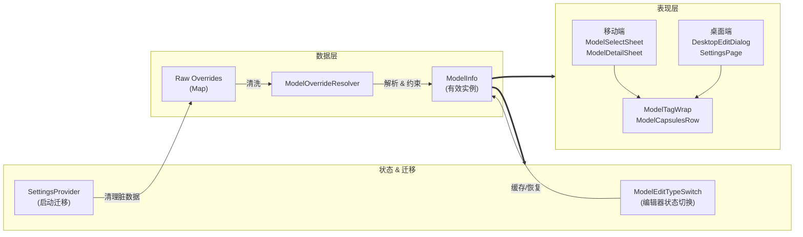
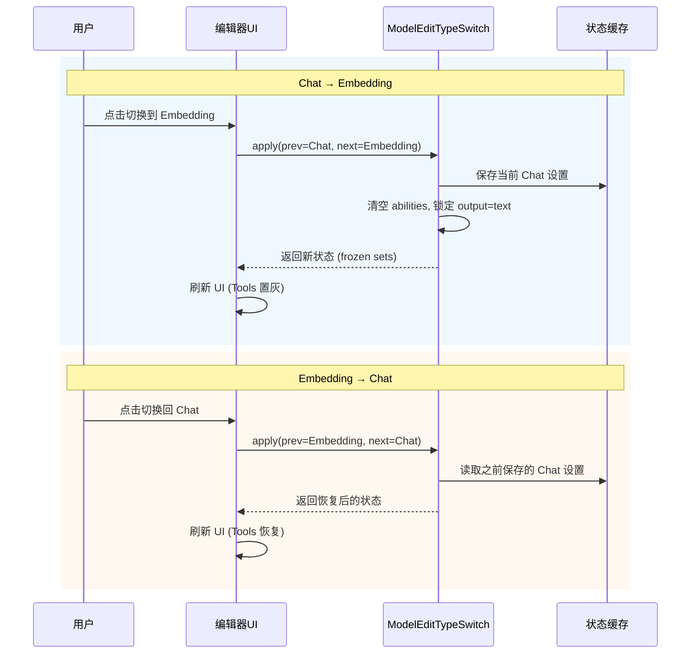

<div align="center">

# fix(model): 统一模型配置解析，修复类型切换数据串扰

**统一 overrides 解析 · 修复 Chat/Embedding 切换串数据 · 存量配置迁移**

<sub>Fixes #223</sub>

<br>

<table>
  <tr>
    <td align="center" width="100"><strong>PR 类型</strong><br><kbd>Bug Fix</kbd></td>
    <td align="center" width="100"><strong>破坏性变更</strong><br>否</td>
    <td align="center" width="100"><strong>文件数</strong><br>18</td>
    <td align="center" width="180"><strong>代码增删</strong><br><code>███████░░░</code><br><ins>+1677</ins> <del>-711</del></td>
  </tr>
</table>

</div>

<br>

---

## 核心目标

<blockquote>
<strong>本次 PR 解决三个问题：</strong>
<br><br>
<kbd>1</kbd> <strong>数据污染</strong> — 用户在 <mark>Chat</mark> 和 <mark>Embedding</mark> 模型间切换时，<code>abilities</code> 和 <code>output</code> 字段会残留，导致 Embedding 模型错误地显示"联网/推理"能力。
<br><br>
<kbd>2</kbd> <strong>逻辑散乱</strong> — Provider Overrides 的解析逻辑散落在各个 UI 和 Service 中，维护困难且行为不一致。
<br><br>
<kbd>3</kbd> <strong>展示混乱</strong> — 不同页面的模型能力标签样式和显示逻辑不统一。
</blockquote>

---

## 架构设计总览



<details>
<summary><strong>展开：编辑器类型切换时序图</strong></summary>
<br>



</details>

---

## 变更详情漫游

<details open>
<summary><h3>核心服务与模型</h3></summary>

<table>
<thead>
<tr>
<th width="280">文件</th>
<th>变更要点</th>
<th width="90" align="right">增删</th>
</tr>
</thead>
<tbody>

<tr>
<td>
<kbd>new</kbd><br>
<code>model_override_resolver.dart</code><br>
<sub>lib/core/services/</sub>
</td>
<td>
<details>
<summary><strong>集中化解析服务 / 强制 Embedding 约束</strong></summary>
<hr>

<ul>
<li><strong>统一归一化</strong>：Key/Value 自动 trim 和转小写</li>
<li><strong>强制约束</strong>：若类型为 <code>embedding</code>，强制 <code>abilities = []</code>，<code>output = [text]</code></li>
<li><strong>诊断日志</strong>：未知 override value 输出调试信息</li>
</ul>

```dart
// 核心逻辑
if (effectiveType == ModelType.embedding) {
  return base.copyWith(
    type: ModelType.embedding,
    output: const [Modality.text],
    abilities: const <ModelAbility>[],
  );
}
```
</details>
</td>
<td align="right"><ins>+155</ins></td>
</tr>

<tr>
<td>
<kbd>new</kbd><br>
<code>model_types.dart</code><br>
<sub>lib/core/models/</sub>
</td>
<td>
<details>
<summary><strong>类型定义抽取 / 数据归一化</strong></summary>
<hr>

<ul>
<li>抽取枚举 <code>ModelType</code>, <code>Modality</code>, <code>ModelAbility</code></li>
<li>新增 <code>ModelInfo</code> 不可变类</li>
<li>构造时自动排序和去重 modalities</li>
</ul>
</details>
</td>
<td align="right"><ins>+83</ins></td>
</tr>

<tr>
<td>
<kbd>refactor</kbd><br>
<code>chat_api_service.dart</code><br>
<sub>lib/core/services/api/</sub>
</td>
<td>
<details>
<summary><strong>运行时接入 Resolver</strong></summary>
<hr>

<ul>
<li>移除硬编码解析，调用 <code>ModelOverrideResolver</code></li>
<li>增加 <code>try-catch</code> 兜底</li>
</ul>
</details>
</td>
<td align="right"><ins>+8</ins><br><del>-20</del></td>
</tr>

</tbody>
</table>
</details>

<details>
<summary><h3>状态管理与迁移</h3></summary>

<table>
<thead>
<tr>
<th width="280">文件</th>
<th>变更要点</th>
<th width="90" align="right">增删</th>
</tr>
</thead>
<tbody>

<tr>
<td>
<kbd>feature</kbd><br>
<code>settings_provider.dart</code><br>
<sub>lib/core/providers/</sub>
</td>
<td>
<details>
<summary><strong>存量数据清洗 / 自动备份</strong></summary>
<hr>

<ul>
<li><strong>启动检查</strong>：版本号落后时触发</li>
<li><strong>自动备份</strong>：写入 <code>provider_configs_backup_v1</code></li>
<li><strong>清洗</strong>：移除 embedding 的 <code>tools</code>, <code>abilities</code>, <code>output</code></li>
</ul>

```dart
if (_embeddingChatOnlyFields.any(ov.containsKey)) {
  for (final k in _embeddingChatOnlyFields) {
    m.remove(k);
  }
}
```
</details>
</td>
<td align="right"><ins>+139</ins></td>
</tr>

<tr>
<td>
<kbd>new</kbd><br>
<code>model_edit_state_helper.dart</code><br>
<sub>lib/features/model/widgets/</sub>
</td>
<td>
<details>
<summary><strong>编辑器状态机 / 防串数据</strong></summary>
<hr>

<ul>
<li><strong>Chat → Embedding</strong>：缓存后清空</li>
<li><strong>Embedding → Chat</strong>：从缓存恢复</li>
<li>返回 frozen sets 防污染</li>
</ul>
</details>
</td>
<td align="right"><ins>+130</ins></td>
</tr>

<tr>
<td>
<kbd>refactor</kbd><br>
<code>model_provider.dart</code><br>
<sub>lib/core/providers/</sub>
</td>
<td>
适配新的 <code>ModelInfo</code> 类型定义，简化 <code>infer</code> 逻辑
</td>
<td align="right"><ins>+12</ins><br><del>-37</del></td>
</tr>

</tbody>
</table>
</details>

<details>
<summary><h3>UI 组件与交互</h3></summary>

<table>
<thead>
<tr>
<th width="280">文件</th>
<th>变更要点</th>
<th width="90" align="right">增删</th>
</tr>
</thead>
<tbody>

<tr>
<td>
<kbd>new</kbd><br>
<code>model_tag_wrap.dart</code><br>
<sub>lib/shared/widgets/</sub>
</td>
<td>
<details>
<summary><strong>统一能力标签组件</strong></summary>
<hr>

<ul>
<li><strong>ModelTagWrap</strong>：移动端流式标签</li>
<li><strong>ModelCapsulesRow</strong>：桌面端胶囊</li>
<li>深色模式 + 无障碍支持</li>
</ul>
</details>
</td>
<td align="right"><ins>+345</ins></td>
</tr>

<tr>
<td>
<kbd>refactor</kbd><br>
<code>model_select_sheet.dart</code><br>
<sub>lib/features/model/widgets/</sub>
</td>
<td>
<details>
<summary><strong>接入 Resolver / Isolate 清洗</strong></summary>
<hr>

<ul>
<li>后台 Isolate 使用 Resolver</li>
<li>修复 Map 类型不兼容问题</li>
<li>使用 <code>ModelTagWrap</code> 替换散落逻辑</li>
</ul>
</details>
</td>
<td align="right"><ins>+153</ins><br><del>-209</del></td>
</tr>

<tr>
<td>
<kbd>refactor</kbd><br>
<code>model_edit_dialog.dart</code><br>
<code>model_detail_sheet.dart</code>
</td>
<td>
接入 <code>ModelEditTypeSwitch</code>，保存时过滤无效字段，修复 Controller 释放遗漏
</td>
<td align="right"><ins>+366</ins><br><del>-164</del></td>
</tr>

<tr>
<td>
<kbd>cleanup</kbd><br>
<samp>provider_detail_page.dart</samp><br>
<samp>model_fetch_dialog.dart</samp><br>
<samp>desktop_settings_page.dart</samp>
</td>
<td>
移除冗余 tag 构建逻辑，统一使用新组件
</td>
<td align="right"><ins>+107</ins><br><del>-281</del></td>
</tr>

</tbody>
</table>
</details>

<details>
<summary><h3>测试与国际化</h3></summary>

<table>
<thead>
<tr>
<th width="280">文件</th>
<th>变更要点</th>
<th width="90" align="right">增删</th>
</tr>
</thead>
<tbody>

<tr>
<td>
<kbd>test</kbd><br>
<code>model_override_resolver_test.dart</code>
</td>
<td>
单元测试：类型切换清理、未知值容错、DisplayName 覆盖、非模型字段透传
</td>
<td align="right"><ins>+143</ins></td>
</tr>

<tr>
<td>
<kbd>i18n</kbd><br>
<code>lib/l10n/*.arb</code>
</td>
<td>
新增中/英文错误提示文案
</td>
<td align="right"><ins>+36</ins></td>
</tr>

</tbody>
</table>
</details>

---

## 行为变化对比

<table>
<thead>
<tr>
<th width="200">场景</th>
<th width="280">修复前</th>
<th width="280">修复后</th>
</tr>
</thead>
<tbody>
<tr>
<td><strong>Chat → Embedding 切换</strong></td>
<td><del>abilities 残留，UI 仍显示"工具调用"标签</del></td>
<td><ins>自动清空 abilities，UI 正确隐藏能力标签</ins></td>
</tr>
<tr>
<td><strong>Embedding → Chat 切换</strong></td>
<td><del>之前的 Chat 设置丢失</del></td>
<td><ins>从会话缓存恢复，设置不丢失</ins></td>
</tr>
<tr>
<td><strong>存量脏数据</strong></td>
<td><del>Embedding 模型可能含 abilities/tools 字段</del></td>
<td><ins>启动时自动迁移清理</ins></td>
</tr>
<tr>
<td><strong>Override 解析</strong></td>
<td><del>散落在 5+ 个文件，行为不一致</del></td>
<td><ins>统一入口 ModelOverrideResolver</ins></td>
</tr>
<tr>
<td><strong>能力标签展示</strong></td>
<td><del>各页面样式/逻辑不统一</del></td>
<td><ins>复用 ModelTagWrap/ModelCapsulesRow</ins></td>
</tr>
</tbody>
</table>

---

## 风险控制与回滚

<table>
<thead>
<tr>
<th width="180">风险点</th>
<th>应对措施</th>
<th width="220">回滚方案</th>
</tr>
</thead>
<tbody>
<tr>
<td><strong>配置迁移失败</strong></td>
<td><code>try-catch</code> 包裹，失败仅打印日志，不阻塞启动</td>
<td>删除 <code>migrations_version_v1</code>，从 <code>provider_configs_backup_v1</code> 恢复</td>
</tr>
<tr>
<td><strong>Override 解析异常</strong></td>
<td>Resolver 内置容错，未知结构降级返回 Base Model</td>
<td>无需回滚，修正配置即可</td>
</tr>
</tbody>
</table>

---

## 审阅指引

<blockquote>

**建议重点审阅以下文件：**

| 优先级 | 文件 | 原因 |
|:---:|---|---|
| <kbd>P0</kbd> | `model_override_resolver.dart` | 核心解析逻辑，影响全局行为 |
| <kbd>P0</kbd> | `model_edit_state_helper.dart` | 类型切换状态机，防串数据核心 |
| <kbd>P1</kbd> | `settings_provider.dart` | 迁移逻辑，涉及用户数据 |
| <kbd>P2</kbd> | `model_tag_wrap.dart` | UI 组件，影响视觉一致性 |

</blockquote>

---

## 验证清单

<details open>
<summary><strong>自动化测试</strong></summary>

```bash
flutter test test/core/services/model_override_resolver_test.dart
```

<sub>预期：全部通过</sub>

</details>

<details>
<summary><strong>手动验证 - 迁移</strong></summary>

| 步骤 | 操作 | 预期结果 |
|:---:|---|---|
| 1 | 构造含脏数据的 <code>provider_configs_v1</code> | - |
| 2 | 启动 App | 控制台输出 <code>[Migration]</code> 日志 |
| 3 | 检查配置 | 脏字段已被移除 |

</details>

<details>
<summary><strong>手动验证 - 编辑交互</strong></summary>

| 步骤 | 操作 | 预期结果 |
|:---:|---|---|
| 1 | 打开模型编辑，选 Chat，勾选 Tools | Tools 选中 |
| 2 | 切换到 Embedding | Tools 选项消失/置灰 |
| 3 | 切换回 Chat | Tools 恢复选中状态 |

</details>

<details>
<summary><strong>UI 走查</strong></summary>

| 页面 | 检查点 |
|---|---|
| 移动端模型列表 | Tag 显示正常 |
| 桌面端模型列表 | 胶囊显示正常 |
| Provider 详情页 | 能力展示与列表一致 |

</details>

---

<div align="center">
<sub>
本 PR 由 <strong>feat-2-model-type-switch-reset-abilities</strong> 分支发起
</sub>
</div>
