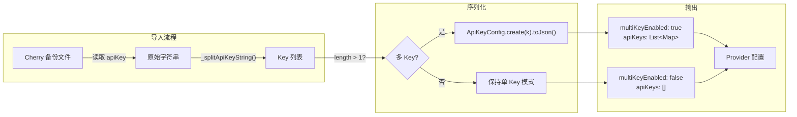
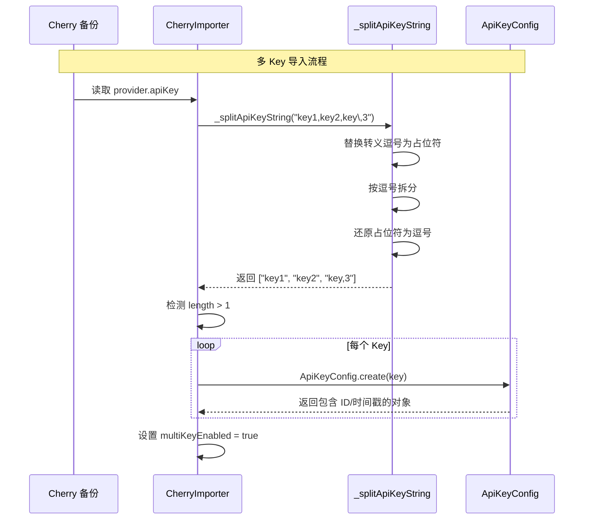

<div align="center">

# fix(import): 支持 Cherry Studio 多 API Key 导入

**解析逗号分隔密钥 · 正确序列化为 ApiKeyConfig · 兼容转义逗号**

<sub>Fixes #198</sub>

<br>

<table>
  <tr>
    <td align="center" width="100"><strong>PR 类型</strong><br><kbd>Bug Fix</kbd></td>
    <td align="center" width="100"><strong>破坏性变更</strong><br>否</td>
    <td align="center" width="100"><strong>文件数</strong><br>1</td>
    <td align="center" width="180"><strong>代码增删</strong><br><code>▰▰▰▰▰▰▰▰▰▱</code><br><ins>+34</ins> <del>-3</del></td>
  </tr>
</table>

</div>

<br>

---

## 核心目标

<blockquote>
<strong>本次 PR 解决一个问题：</strong>
<br><br>
<kbd>1</kbd> <strong>多 Key 丢失</strong> — Cherry Studio 允许用户为单个 Provider 配置多个 API Key（逗号分隔存储）。此前 Kelivo 将整个字符串作为单个 Key 导入，导致多 Key 配置丢失、Key 轮换功能失效。
</blockquote>

---

## 架构设计总览



<details>
<summary><strong>展开：Key 解析时序图</strong></summary>
<br>



</details>

---

## 变更详情漫游

<details open>
<summary><h3>备份导入服务</h3></summary>

<table>
<thead>
<tr>
<th width="280">文件</th>
<th>变更要点</th>
<th width="90" align="right">增删</th>
</tr>
</thead>
<tbody>

<tr>
<td>
<kbd>fix</kbd><br>
<code>cherry_importer.dart</code><br>
<sub>lib/core/services/backup/</sub>
</td>
<td>
<details>
<summary><strong>多 Key 解析与序列化</strong></summary>
<hr>

<ul>
<li><strong>新增导入</strong>：引入 <code>ApiKeyConfig</code> 模型</li>
<li><strong>解析逻辑</strong>：新增 <code>_splitApiKeyString()</code> 私有函数，使用占位符替换法处理转义逗号（避免正则后行断言的跨平台兼容问题）</li>
<li><strong>多 Key 检测</strong>：当 Key 数量 > 1 时设置 <code>multiKeyEnabled = true</code></li>
<li><strong>正确序列化</strong>：每个 Key 通过 <code>ApiKeyConfig.create(k).toJson()</code> 转换，确保包含 ID、时间戳等元数据，与 <code>ProviderConfig.fromJson</code> 期望的数据结构一致</li>
</ul>

```dart
// 解析逗号分隔的 Key
final apiKeys = _splitApiKeyString(apiKeyRaw);
final multiKeyEnabled = apiKeys.length > 1;

// 序列化为 ApiKeyConfig 对象
'apiKeys': multiKeyEnabled
    ? apiKeys.map((k) => ApiKeyConfig.create(k).toJson()).toList()
    : const <dynamic>[],
```
</details>
</td>
<td align="right"><ins>+34</ins><br><del>-3</del></td>
</tr>

</tbody>
</table>
</details>

---

## 行为变化对比

<table>
<thead>
<tr>
<th width="200">场景</th>
<th width="280">修复前</th>
<th width="280">修复后</th>
</tr>
</thead>
<tbody>
<tr>
<td><strong>多 Key 导入</strong></td>
<td><del>整串作为单个 Key，Key 轮换失效</del></td>
<td><ins>正确拆分为多个 ApiKeyConfig，轮换正常</ins></td>
</tr>
<tr>
<td><strong>含转义逗号的 Key</strong></td>
<td><del>被错误拆分为多个无效 Key</del></td>
<td><ins>正确保留逗号字符</ins></td>
</tr>
<tr>
<td><strong>单 Key 导入</strong></td>
<td>正常</td>
<td>行为不变</td>
</tr>
<tr>
<td><strong>App 重启后</strong></td>
<td><del>多 Key 数据丢失（类型不匹配导致反序列化失败）</del></td>
<td><ins>数据持久化正常</ins></td>
</tr>
</tbody>
</table>

---

## 风险控制与回滚

<table>
<thead>
<tr>
<th width="180">风险点</th>
<th>应对措施</th>
<th width="220">回滚方案</th>
</tr>
</thead>
<tbody>
<tr>
<td><strong>Key 解析异常</strong></td>
<td>空字符串直接返回空列表，不会抛出异常</td>
<td>无需回滚，重新导入即可</td>
</tr>
<tr>
<td><strong>占位符冲突</strong></td>
<td>使用 <code>\x00</code>（NUL 字符），API Key 中极不可能包含</td>
<td>无需回滚</td>
</tr>
</tbody>
</table>

---

## 审阅指引

<blockquote>

**建议重点审阅以下部分：**

| 优先级 | 位置 | 原因 |
|:---:|---|---|
| <kbd>P0</kbd> | `_splitApiKeyString()` 函数 | 核心解析逻辑，需确认转义处理正确 |
| <kbd>P0</kbd> | `ApiKeyConfig.create(k).toJson()` 调用 | 确保序列化结构与 `ProviderConfig.fromJson` 兼容 |

</blockquote>

---

## 验证清单

<details open>
<summary><strong>手动验证 - 多 Key 导入</strong></summary>

| 步骤 | 操作 | 预期结果 |
|:---:|---|---|
| 1 | 在 Cherry Studio 中为某 Provider 配置多个 Key | - |
| 2 | 导出 Cherry Studio 备份 | - |
| 3 | 在 Kelivo 中导入该备份 | Provider 显示多 Key 已启用 |
| 4 | 重启 App | 多 Key 配置仍然存在 |

</details>

<details>
<summary><strong>手动验证 - 转义逗号</strong></summary>

| 步骤 | 操作 | 预期结果 |
|:---:|---|---|
| 1 | 在 Cherry 备份中手动添加含 <code>\,</code> 的 Key | - |
| 2 | 导入备份 | Key 中的逗号被正确保留 |

</details>

---

<div align="center">
<sub>
本 PR 由 <strong>XiaoBuHaly:fix-cherry-import-multikey</strong> 分支发起
</sub>
</div>
