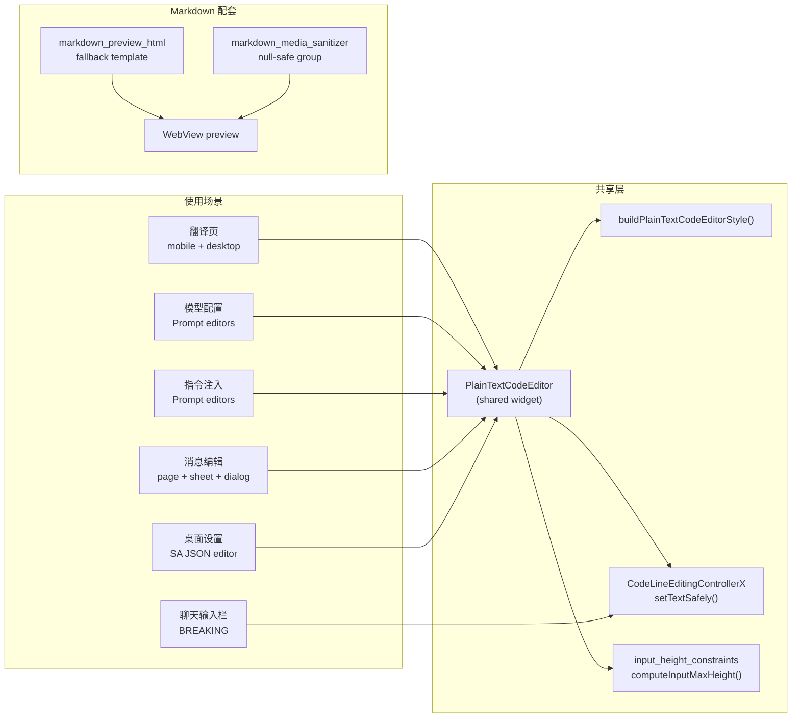

<div align="center">

# refactor(editor): 统一文本编辑迁移至 re_editor，抽取共享组件与防抖保存

**共享 PlainTextCodeEditor · Markdown 预览加固 · 多场景迁移至 CodeLineEditingController · BREAKING**

<sub>Fixes #186</sub>

<br>

<table>
  <tr>
    <td align="center" width="100"><strong>PR 类型</strong><br><kbd>Refactor</kbd></td>
    <td align="center" width="100"><strong>破坏性变更</strong><br>是</td>
    <td align="center" width="100"><strong>文件数</strong><br>24</td>
    <td align="center" width="180"><strong>代码增删</strong><br><code>▰▰▰▰▰▰▱▱▱▱</code><br>$$\color{green} \text{+2090}$$ $$\color{red} \text{-1528}$$</td>
  </tr>
</table>

</div>

<br>

---

## 核心目标

<blockquote>
<strong>本次 PR 解决四类问题：</strong>
<br><br>
<kbd>1</kbd> <strong>重复与不一致</strong> — 多处文本编辑分别使用 <code>TextField</code> / 裸 <code>CodeEditor</code>，样式/行为分散且维护成本高；本次抽取共享 <code>PlainTextCodeEditor</code> 与辅助工具，统一配置与交互细节。
<br><br>
<kbd>2</kbd> <strong>稳定性与数据安全</strong> — Markdown 预览模板缺少兜底、行内媒体替换存在空捕获崩溃点；本次增加 fallback 并修复 null-safe 处理，避免异常导致渲染/流式输出中断。
<br><br>
<kbd>3</kbd> <strong>性能与保存抖动</strong> — 翻译流式输出、桌面设置等场景存在频繁 UI 更新/写盘；本次引入缓冲 flush 与 debounce 保存，降低抖动与卡顿风险。
<br><br>
<kbd>4</kbd> <strong>聊天输入迁移（BREAKING）</strong> — 聊天输入体系从 <code>TextEditingController</code> 迁移到 <code>CodeLineEditingController</code>，提升编辑能力并统一快捷键与 IME 组合输入处理；依赖旧 Controller 类型的调用方需要适配。
</blockquote>

---

## 架构设计总览



---

## 变更详情漫游

<details open>
<summary><h3>共享编辑器与工具</h3></summary>

<table>
<thead>
<tr>
<th width="280">文件</th>
<th>变更要点</th>
<th width="90" align="right">增删</th>
</tr>
</thead>
<tbody>

<tr>
<td>
<kbd>new</kbd><br>
<code>plain_text_code_editor.dart</code><br>
<sub>lib/shared/widgets/</sub>
</td>
<td>
<details>
<summary><strong>统一 PlainTextCodeEditor</strong></summary>
<ul>
<li>封装 <code>CodeEditor</code> 的通用参数：<code>NonCodeChunkAnalyzer</code>、隐藏 indicator、主题化样式</li>
<li>支持按需覆写：字体/行高/选区色/提示文本透明度等</li>
</ul>
<sub>本部分由AI辅助生成</sub>
</details>
</td>
<td align="right"><ins>+140</ins></td>
</tr>

<tr>
<td>
<kbd>new</kbd><br>
<code>re_editor_utils.dart</code><br>
<sub>lib/utils/</sub>
</td>
<td>
<details>
<summary><strong>setTextSafely：统一安全同步</strong></summary>
<ul>
<li>统一 <code>String</code> → <code>CodeLineEditingValue</code>（selection 到末尾）</li>
<li>默认跳过 IME composing，避免打断组合输入</li>
<li>异常回退到 <code>controller.text</code>，避免数据丢失</li>
</ul>
<sub>本部分由AI辅助生成</sub>
</details>
</td>
<td align="right"><ins>+58</ins></td>
</tr>

<tr>
<td>
<kbd>new</kbd><br>
<code>input_height_constraints.dart</code><br>
<sub>lib/shared/widgets/</sub>
</td>
<td>统一大文本输入高度上限计算（考虑 <code>viewInsets</code>、保留区域、最小高度等），避免溢出。</td>
<td align="right"><ins>+62</ins></td>
</tr>

</tbody>
</table>
</details>

<details>
<summary><h3>Markdown 预览与媒体安全</h3></summary>

<table>
<thead>
<tr>
<th width="280">文件</th>
<th>变更要点</th>
<th width="90" align="right">增删</th>
</tr>
</thead>
<tbody>

<tr>
<td>
<kbd>fix</kbd><br>
<code>markdown_preview_html.dart</code><br>
<code>markdown_media_sanitizer.dart</code>
</td>
<td>
<ul>
<li>预览模板加载失败时使用 fallback HTML，避免崩溃</li>
<li>行内 base64 图片替换：regex 捕获组改为 null-safe，异常形态保留原片段</li>
</ul>
</td>
<td align="right"><ins>+85</ins><br><del>-13</del></td>
</tr>

</tbody>
</table>
<sub>本部分由AI辅助生成</sub>
</details>

<details>
<summary><h3>页面迁移（翻译 / 模型 / 指令 / 消息编辑 / 设置）</h3></summary>

<table>
<thead>
<tr>
<th width="280">模块</th>
<th>涉及文件</th>
<th>变更要点</th>
<th width="90" align="right">增删</th>
</tr>
</thead>
<tbody>

<tr>
<td><kbd>translate</kbd></td>
<td>
<code>translate_page.dart</code><br>
<code>desktop_translate_page.dart</code>
</td>
<td>
迁移至共享编辑器；流式输出增加缓冲与定时 flush，避免频繁 setState；runId 防止旧流回填。
</td>
<td align="right"><ins>+219</ins><br><del>-99</del></td>
</tr>

<tr>
<td><kbd>model</kbd></td>
<td>
<code>default_model_page.dart</code><br>
<code>default_model_pane.dart</code><br>
<code>ocr_prompt_sheet.dart</code>
</td>
<td>Prompt/JSON 等大文本编辑统一迁移至 <code>PlainTextCodeEditor</code>，并复用高度约束。</td>
<td align="right"><ins>+799</ins><br><del>-742</del></td>
</tr>

<tr>
<td><kbd>instruction</kbd></td>
<td>
<code>instruction_injection_page.dart</code><br>
<code>instruction_injection_pane.dart</code>
</td>
<td>指令 Prompt 编辑迁移至共享编辑器，并用 <code>setTextSafely()</code> 统一同步策略。</td>
<td align="right"><ins>+161</ins><br><del>-44</del></td>
</tr>

<tr>
<td><kbd>message edit</kbd></td>
<td>
<code>message_edit_page.dart</code><br>
<code>message_edit_sheet.dart</code><br>
<code>message_edit_dialog.dart</code>
</td>
<td>消息编辑页/Sheet/桌面对话框迁移到共享编辑器，避免手写 selection/composing 逻辑。</td>
<td align="right"><ins>+92</ins><br><del>-78</del></td>
</tr>

<tr>
<td><kbd>settings</kbd></td>
<td><code>desktop_settings_page.dart</code></td>
<td>SA JSON 编辑迁移并引入 debounce 保存（400ms），保留失焦保存与 dispose flush。</td>
<td align="right"><ins>+81</ins><br><del>-38</del></td>
</tr>

</tbody>
</table>
<sub>本部分由AI辅助生成</sub>
</details>

<details>
<summary><h3>聊天输入迁移（BREAKING）</h3></summary>

<blockquote>
<strong>破坏性变更说明：</strong>
<br><br>
输入栏 Controller 类型升级为 <code>CodeLineEditingController</code>，涉及以下 API：
<ul>
<li><code>ChatInputBar.controller</code>（<code>TextEditingController?</code> → <code>CodeLineEditingController?</code>）</li>
<li><code>ChatInputSection.inputController</code>（<code>TextEditingController</code> → <code>CodeLineEditingController</code>）</li>
<li><code>HomePageController.inputController</code>（<code>TextEditingController</code> → <code>CodeLineEditingController</code>）</li>
</ul>
</blockquote>

<table>
<thead>
<tr>
<th width="280">文件</th>
<th>变更要点</th>
<th width="90" align="right">增删</th>
</tr>
</thead>
<tbody>
<tr>
<td>
<code>chat_input_bar.dart</code><br>
<code>chat_input_section.dart</code><br>
<code>home_page.dart</code><br>
<code>home_page_controller.dart</code>
</td>
<td>
<ul>
<li>输入区使用 <code>PlainTextCodeEditor</code>（短文本输入模式）</li>
<li>快捷键/换行策略与 IME composing 保护集中处理</li>
<li>使用 <code>replaceSelection</code>/<code>applyNewLine</code> 等 API 替代 TextField 逻辑</li>
</ul>
</td>
<td align="right"><ins>+387</ins><br><del>-511</del></td>
</tr>
</tbody>
</table>
</details>

<details>
<summary><h3>依赖与杂项</h3></summary>

<table>
<thead>
<tr>
<th width="280">文件</th>
<th>变更要点</th>
<th width="90" align="right">增删</th>
</tr>
</thead>
<tbody>
<tr>
<td>
<code>pubspec.yaml</code><br>
<code>app_directories.dart</code><br>
<code>avatar_cache.dart</code><br>
<code>sandbox_path_resolver.dart</code>
</td>
<td>
<ul>
<li>新增依赖：<code>re_editor</code></li>
<li>utils 小清理（无行为变化）</li>
</ul>
</td>
<td align="right"><ins>+6</ins><br><del>-4</del></td>
</tr>
</tbody>
</table>
<sub>本部分由AI辅助生成</sub>
</details>

---

## 行为变化对比

<table>
<thead>
<tr>
<th width="200">场景</th>
<th width="280">变更前</th>
<th width="280">变更后</th>
</tr>
</thead>
<tbody>
<tr>
<td><strong>多场景文本编辑</strong></td>
<td><del>各页面自建 TextField/CodeEditor，风格与行为不一</del></td>
<td><ins>统一使用 PlainTextCodeEditor + 共享约束与工具</ins></td>
</tr>
<tr>
<td><strong>翻译流式输出</strong></td>
<td><del>chunk 频繁刷新导致 UI 抖动</del></td>
<td><ins>缓冲 + 定时 flush，减少 UI churn；runId 防止旧流回填</ins></td>
</tr>
<tr>
<td><strong>桌面设置 SA JSON 保存</strong></td>
<td><del>每次输入都写入配置，可能卡顿/乱序</del></td>
<td><ins>debounce(400ms)+失焦/退出兜底 flush，减少写盘次数</ins></td>
</tr>
<tr>
<td><strong>Markdown 预览</strong></td>
<td><del>模板缺失/异常可能导致崩溃</del></td>
<td><ins>fallback 模板兜底；sanitizer null-safe 避免流式崩溃</ins></td>
</tr>
</tbody>
</table>
<sub>本部分由AI辅助生成</sub>

---

## 风险控制与回滚

<table>
<thead>
<tr>
<th width="180">风险点</th>
<th>应对措施</th>
<th width="220">回滚方案</th>
</tr>
</thead>
<tbody>
<tr>
<td><strong>聊天输入 BREAKING</strong></td>
<td>在提交与 PR 中明确标注 BREAKING；集中到同一模块，便于 review 与回滚。</td>
<td>单独回滚 chat-input commit，或整体回滚本 PR。</td>
</tr>
<tr>
<td><strong>防抖导致“未保存”感</strong></td>
<td>关键场景保留失焦保存与 dispose flush；后续可补充“保存中”提示。</td>
<td>调小 debounce 间隔或恢复即时保存（不推荐）。</td>
</tr>
<tr>
<td><strong>re_editor 行为差异</strong></td>
<td>共享组件集中封装，统一配置与 IME 保护；出问题可单场景回退。</td>
<td>将对应页面回退到 TextField（最小化回滚面）。</td>
</tr>
</tbody>
</table>
<sub>本部分由AI辅助生成</sub>

---

## 审阅指引

<blockquote>

**建议重点审阅以下文件：**

| 优先级 | 文件 | 原因 |
|:---:|---|---|
| <kbd>P0</kbd> | `plain_text_code_editor.dart` | 共享编辑器入口，影响所有迁移场景 |
| <kbd>P0</kbd> | `re_editor_utils.dart` | setTextSafely/IME 保护，避免数据丢失与状态冲突 |
| <kbd>P0</kbd> | `chat_input_bar.dart` | BREAKING 变更核心；快捷键/换行/粘贴等关键交互 |
| <kbd>P1</kbd> | `translate_page.dart` / `desktop_translate_page.dart` | 流式输出 debounce 与 runId 防回填 |
| <kbd>P1</kbd> | `desktop_settings_page.dart` | SA JSON debounce 保存与失焦 flush |
| <kbd>P2</kbd> | `markdown_preview_html.dart` / `markdown_media_sanitizer.dart` | 预览兜底与媒体替换安全性 |

</blockquote>
<sub>本部分由AI辅助生成</sub>

---

## 验证清单

<details open>
<summary><strong>构建与静态检查</strong></summary>

```bash
flutter pub get
flutter analyze
```

<sub>预期：无新增错误；核心路径可运行</sub>

</details>

<details>
<summary><strong>手动验证 - 编辑与保存</strong></summary>

| 步骤 | 操作 | 预期结果 |
|:---:|---|---|
| 1 | 在翻译页、模型 Prompt、指令注入、消息编辑中编辑内容 | 使用统一编辑器样式，输入流畅 |
| 2 | 翻译流式输出过程中多次点击“停止/重新翻译” | 不会出现旧内容回填 |
| 3 | 桌面设置 SA JSON 连续输入后停顿 | 约 400ms 后保存一次；失焦时也会保存 |

</details>

<details>
<summary><strong>手动验证 - 聊天输入（BREAKING 路径）</strong></summary>

| 步骤 | 操作 | 预期结果 |
|:---:|---|---|
| 1 | 输入、换行、发送（Enter/Shift/Ctrl 组合） | 行为与设置项一致 |
| 2 | 粘贴文本/图片、附件、快捷短语插入 | 正常工作，不触发 setState after dispose |

</details>

---

<div align="center">
<sub>

本 PR 由 **[XiaoBuHaly:refactor/re-editor-input](https://github.com/XiaoBuHaly/kelivo/tree/refactor/re-editor-input)** 发起

</sub>
</div>